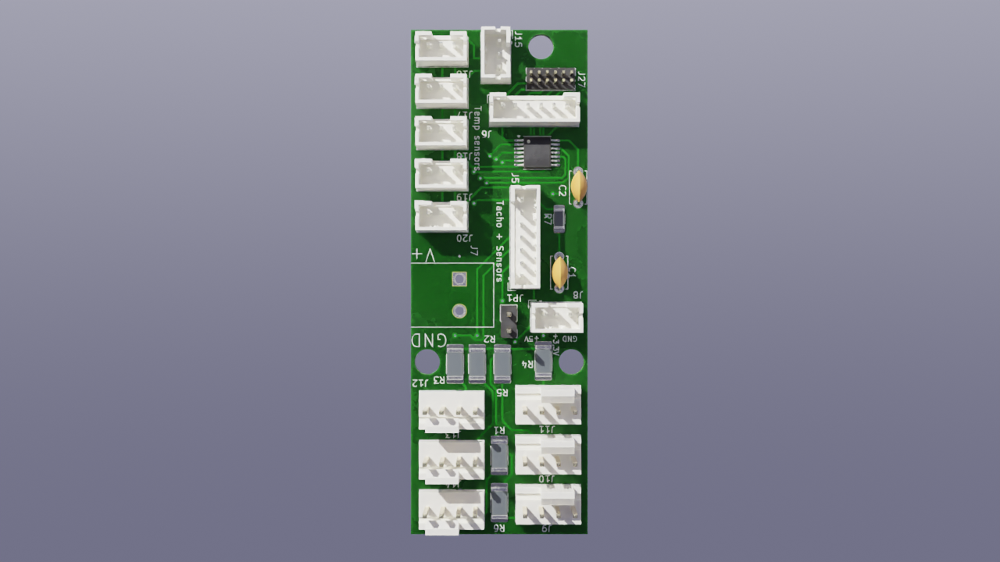

# Barklind-ESP32-POE-Fan-Expansion
Circuit that allows for controlling and powering 4 pin pwm fans using POE and an ethernet connected esp32

For overview of latest schematic, check out [Barklind PDF Schematic](docs/Schematic/Barklind-schematic.pdf)

# PCB Render

